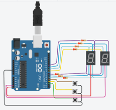

# Parcial Parte 1 

## Integrantes 
- Facundo Chiappa
- Agustin Carmona
- Felipe Sznec
- Luz Cartolano

## Proyecto: Contador binario.

## Descripción
Realizamos un contador que va de 0 a 99 a traves de dos Displays de 7 segmentos 
utilizando el metodo de multiplexacion para controlar cada display independientemente
debido a que estos estaban conectados en paralelo. A su vez, añadimos la funcionalidad
de 3 botones los cuales tenian cada uno un funcionamiento distinto, un boton aumentaba
la cuenta, el otro restaba la cuenta y por ultimo el tercer boton reiniciaba el contador 
a su estado original, es decir, a 00.

## :robot: Link al proyecto
- [proyecto](https://www.tinkercad.com/things/iyHLEff0hUF)
